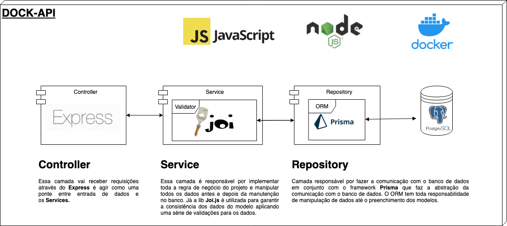

## Description

API to manage bank accounts with the following features:
* Create persons and accounts;
* Deposit and Withdraw money;
* Manage accounts status;
* Extract of all transactions by period.

## Install

To install project dependencies run
```sh
$ npm i
```
Install [Docker](https://docs.docker.com/get-docker/).

### Using Docker Compose

You can run using [docker-compose](https://docs.docker.com/compose/).

```bash
$ docker-compose up -d
```
Docker compose will create the containers (API and Postgres), run application and auto create the Database structure.

### The API
The project will be running at
[http://localhost:4000](http://localhost:4000)

You can use [Postman](https://www.postman.com/) importing te collection available in folder _resources/DOCK API_postman_collection.json_ or requesting to following end-points:

> The requested person for tests can be found on postman collection

Type | End-point                             | Description
---- | ------------------------------------- | ------
GET  | /person                               | List all persons
GET  | /person/:personId                     | Get one person by id
POST | /person                               | Create a person providing JSON body { nome, cpf, dataNascimento }
GET  | /account/:accountId                   | Get one bank account by id
GET  | /account/extract/:accountId           | Get the extract off of an account. Query params iniDate and endDate can also be used
POST | /account                              | Create an account providing JSON body { idPessoa, saldo, limiteSaqueDiario, tipoConta }
PATCH| /account/status/:accountId/:newStatus | Used to activate or deactivate an account. Send newStatus as 0 or 1
POST | /transaction/:type                    | Types are 'deposit' or 'withdraw' transaction. Provides JSON body { idConta, valor }


## Testing

The tests was implemented using [Jest](https://jestjs.io/), to run use:
```sh
$ npm test
```
Jest will show tests and all file coverage.

## Arquitecture

Here you can see the entire API arquitecture:

